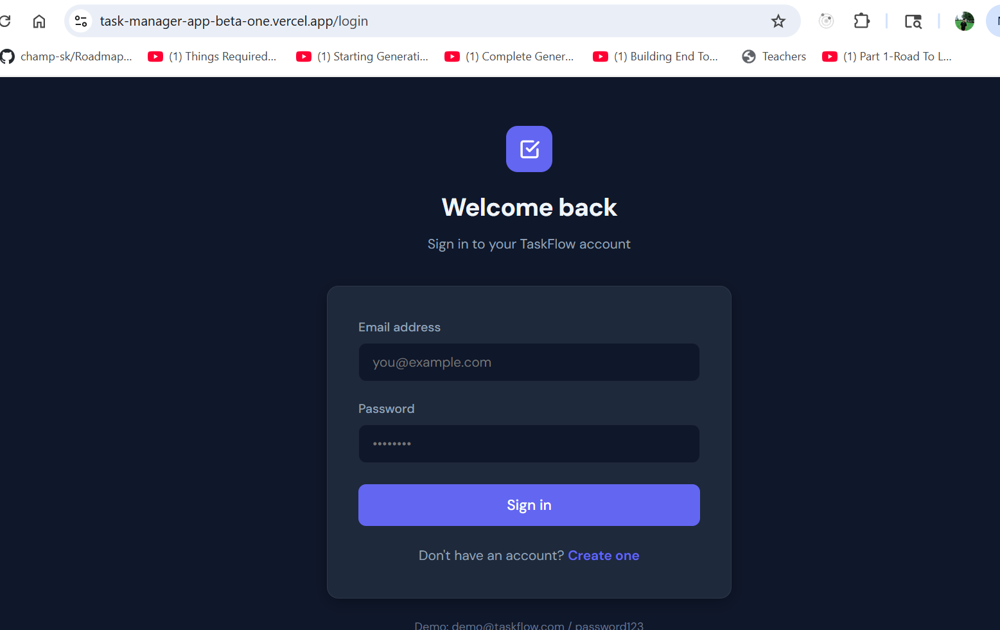
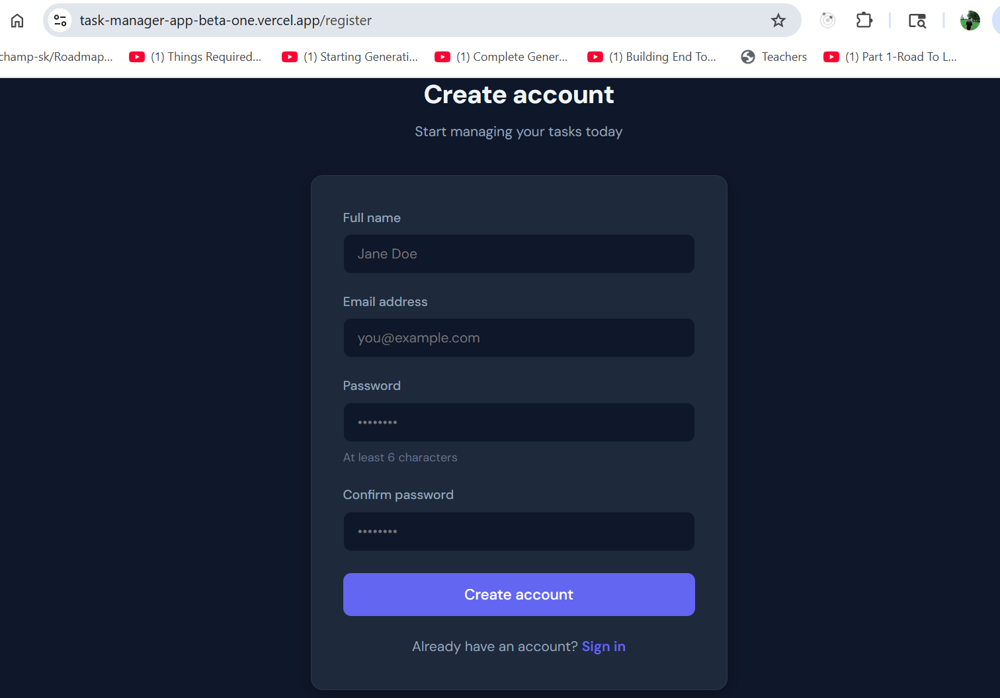
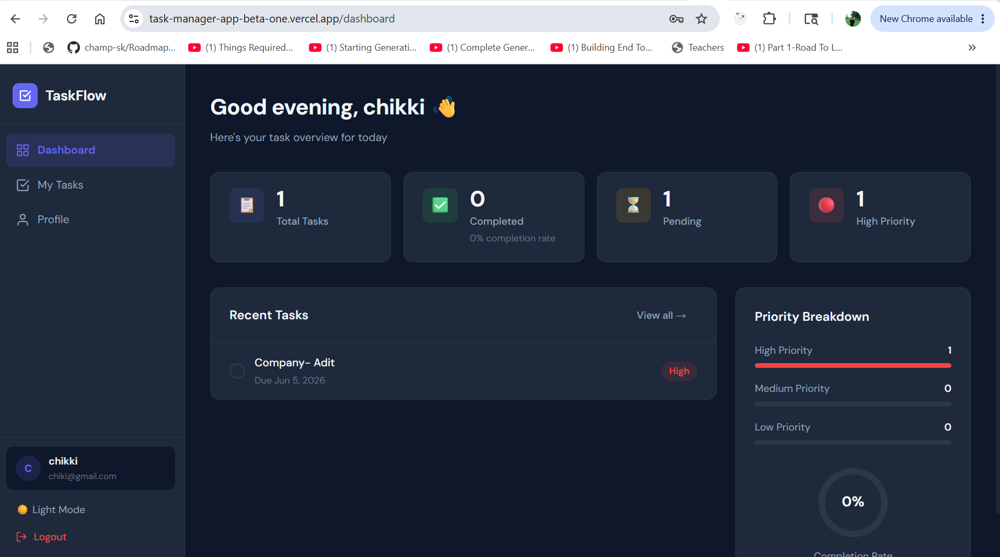
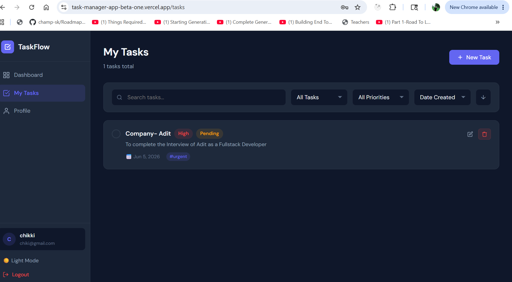
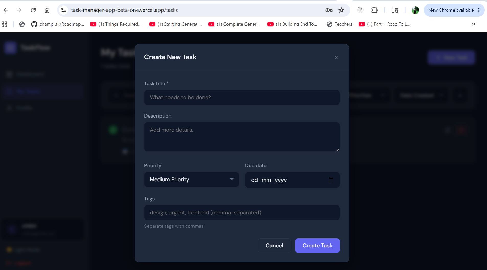
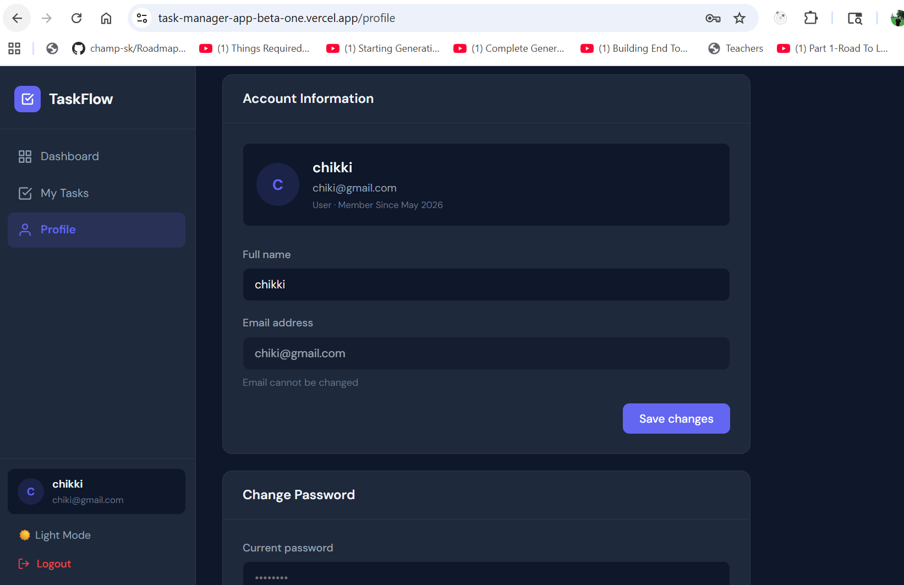
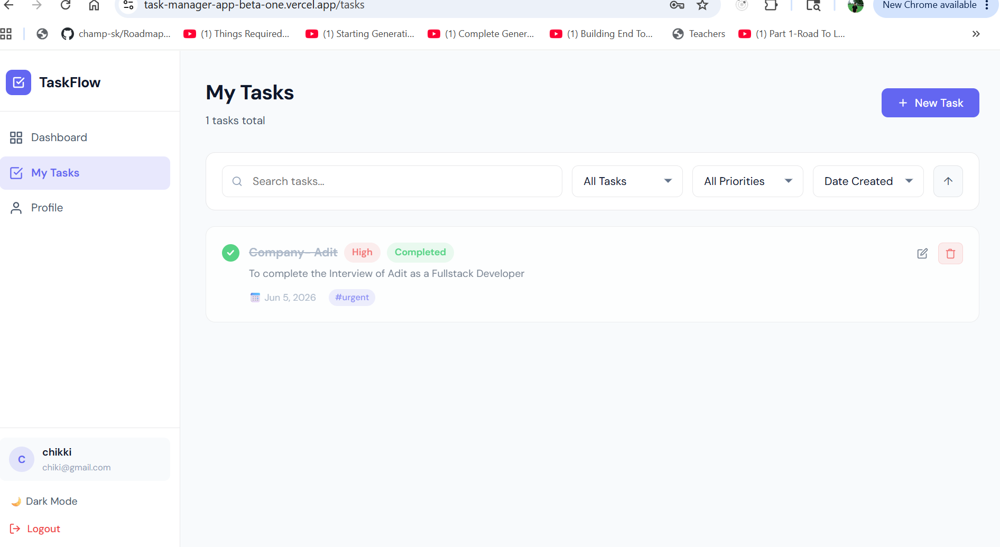
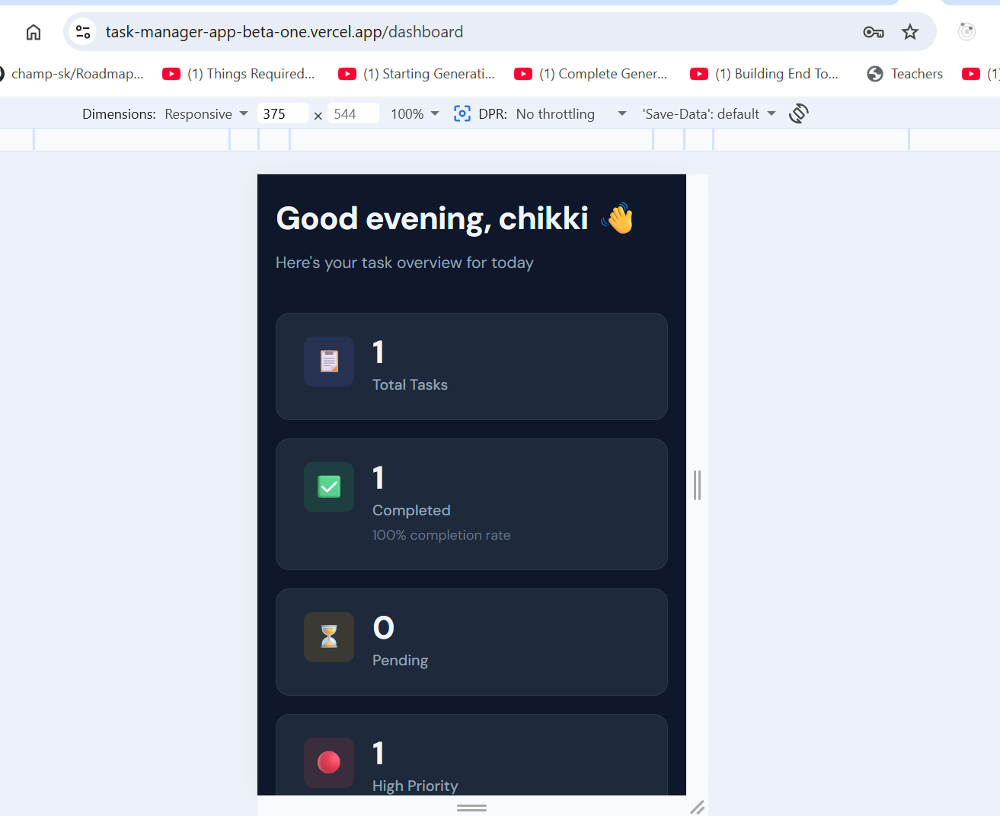

# TaskFlow API
A production‑grade full‑stack Task Management Web Application built with React.js, Node.js + Express, and MongoDB Atlas. Features JWT authentication, real‑time filters, pagination, dark/light mode, Docker support, and secure deployment on Render + Vercel.

✨ Features
Frontend
🔐 JWT‑based login & registration with form validation

📊 Dashboard with live stats, completion ring, priority breakdown

✅ Create, edit, delete, and toggle tasks

🔍 Search, filter (status/priority), sort, and paginate tasks

🏷️ Tags, due dates, priority levels per task

🌙 Dark / Light mode toggle (persisted)

📱 Fully responsive (mobile + desktop)

⚡ Optimistic UX with React Query caching

Backend
🔑 JWT access + refresh token authentication

🛡️ Protected routes with role‑based access (user / admin)

📦 Full CRUD for tasks with ownership enforcement

🔎 Search (regex), filter, sort, paginate via query params

📈 Task stats aggregation endpoint

🚦 Rate limiting, Helmet security, CORS

✅ Input validation with express‑validator

🧪 Unit tests with Jest + Supertest

## 🚀 Features Implemented
- Express server setup with middleware (Helmet, CORS, Morgan, Rate Limiting).
- Health check endpoint (`/health`).
- MongoDB connection utility (`config/db.js`).
- User model with password hashing and role support.
- Task model with validation, indexes, and user association.
- Utility helpers:
  - **JWT (`utils/jwt.js`)** → generate and verify access/refresh tokens.
  - **ApiResponse (`utils/apiResponse.js`)** → standardized success, error, and paginated responses.
- Middleware:
  - **Auth (`middleware/auth.js`)** → protects routes and enforces role-based access.
  - **ErrorHandler (`middleware/errorHandler.js`)** → centralized error handling.
  - **NotFound (`middleware/notFound.js`)** → handles undefined routes.
  - **Validate (`middleware/validate.js`)** → handles request validation errors.
- Controllers:
  - **Auth (`controllers/auth.controller.js`)** → register, login, refresh token, logout, and get profile.
  - **Task (`controllers/task.controller.js`)** → CRUD operations, status toggle, and stats aggregation.
  - **User (`controllers/user.controller.js`)** → profile update, password change, and admin user listing.
- Routes:
  - **Auth (`routes/auth.routes.js`)** → endpoints for register, login, refresh, logout, and profile.
  - **Task (`routes/task.routes.js`)** → endpoints for task CRUD, toggle, and stats.
  - **User (`routes/user.routes.js`)** → endpoints for profile update, password change, and admin listing.

---

## 📸 Screenshots

### Login & Register



### Dashboard


### Task Management



### Profile


### Light Mode


### Mobile View


## 📁 Project Structure

```
TASKMANAGER/
├── backend/
│   ├── config/          # DB connection, Swagger config
│   ├── controllers/     # auth, task, user controllers
│   ├── middleware/      # auth guard, error handler, validator
│   ├── models/          # User, Task Mongoose schemas
│   ├── routes/          # auth, task, user routes
│   ├── tests/           # Jest + Supertest unit tests
│   ├── utils/           # JWT helpers, ApiResponse class
│   ├── app.js           # Express app setup
│   └── server.js        # Entry point
├── frontend/
│   ├── public/
│   └── src/
│       ├── api/         # Axios instance + API modules
│       ├── components/  # Reusable UI, layout, task, auth components
│       ├── context/     # AuthContext, ThemeContext
│       ├── hooks/       # useTasks, useForm custom hooks
│       ├── pages/       # Dashboard, Tasks, Login, Register, Profile
│       └── utils/       # Date formatting helpers
├── docs/
│   └── screenshots/
│       ├── login.png
│       ├── register.png
│       ├── dashboard.png
│       ├── tasks.png
│       ├── create-task.png
│       ├── profile.png
│       ├── light-mode.png
│       └── mobile.png
└── README.md
```

## ⚙️ Installation & Setup
1. Clone the repository:
   git clone https://github.com/champ-sk/task-manager-app.git
   cd backend
2. Install dependencies:
   npm install
3. Create a .env file in the root with:
   PORT=5000
   NODE_ENV=development
   MONGO_URI=mongodb://localhost:27017/taskflow(used the live one here)
   CLIENT_URL=http://localhost:3000
   RATE_LIMIT_WINDOW_MS=900000
   RATE_LIMIT_MAX=100

4. Run the server:
   node server.js
   

