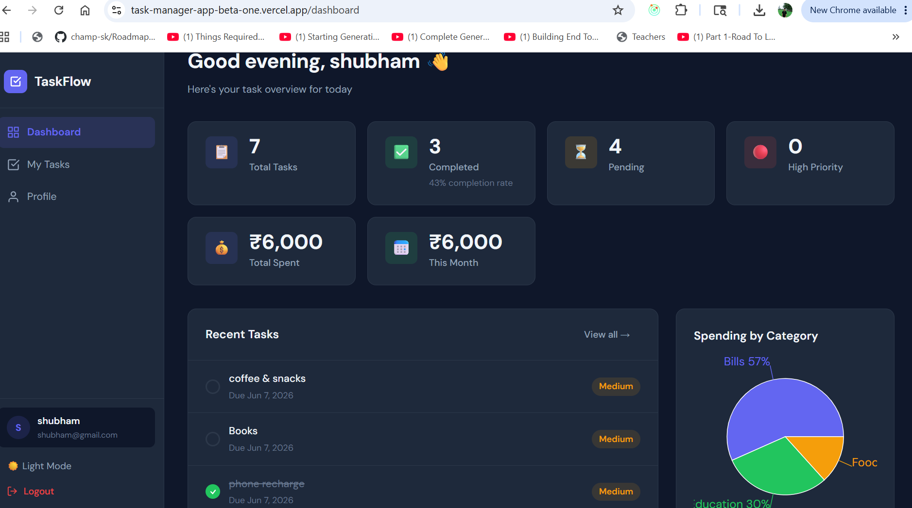
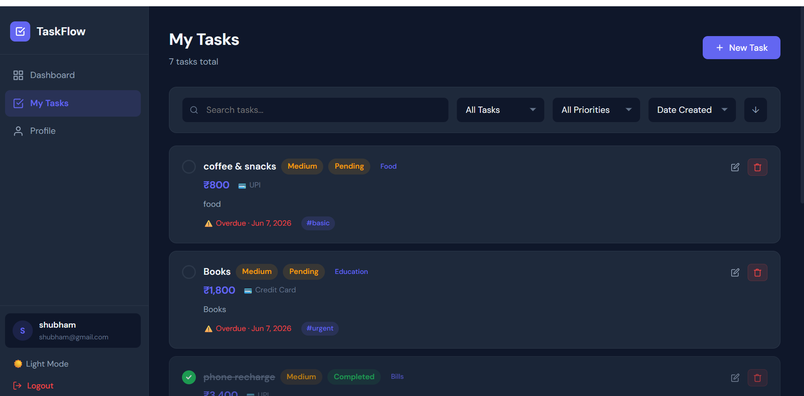

# TaskFlow — Task & Expense Manager

A production-grade full-stack **Task & Expense Management Web Application** 
built with **React.js**, **Node.js + Express**, and **MongoDB Atlas**. 
Features JWT authentication, expense tracking with charts, real-time filters, 
pagination, dark/light mode, and secure deployment on Render + Vercel.

✨ Features
Frontend
🔐 JWT‑based login & registration with form validation

📊 Dashboard with live stats, completion ring, priority breakdown

✅ Create, edit, delete, and toggle tasks

🔍 Search, filter (status/priority), sort, and paginate tasks

🏷️ Tags, due dates, priority levels per task

🌙 Dark / Light mode toggle (persisted)

📱 Fully responsive (mobile + desktop)

⚡ Optimistic UX with React Query caching

💰 Expense tracking with amount, category, and payment method

📊 Pie chart — spending breakdown by category

📈 Line chart — monthly expense trend (last 6 months)

🗓️ Expense date tracking per task

Backend
🔑 JWT access + refresh token authentication

🛡️ Protected routes with role‑based access (user / admin)

📦 Full CRUD for tasks with ownership enforcement

🔎 Search (regex), filter, sort, paginate via query params

📈 Task stats aggregation endpoint

🚦 Rate limiting, Helmet security, CORS

✅ Input validation with express‑validator

🧪 Unit tests with Jest + Supertest

## 🛠️ Tech Stack
```
| Layer      | Technology                                        |
|------------|---------------------------------------------------|
| Frontend   | React 18, React Router v6, React Query v5, Axios  |
| Backend    | Node.js, Express.js                               |
| Database   | MongoDB + Mongoose (Atlas)                        |
| Auth       | JWT (access + refresh tokens)                     |
| Charts     | Recharts                                          |
| Styling    | Pure CSS with CSS variables                       |
| Testing    | Jest, Supertest                                   |
| Deployment | Render (backend), Vercel (frontend)               |
```

## 📡 API Reference
```
### Auth Endpoints
| Method | Route                    | Auth | Description          |
|--------|--------------------------|------|----------------------|
| POST   | /api/auth/register       | No   | Register new user    |
| POST   | /api/auth/login          | No   | Login, get tokens    |
| GET    | /api/auth/me             | Yes  | Get current user     |
| POST   | /api/auth/refresh-token  | No   | Refresh access token |
| POST   | /api/auth/logout         | Yes  | Logout               |

### Task Endpoints
| Method | Route                    | Auth | Description                      |
|--------|--------------------------|------|----------------------------------|
| GET    | /api/tasks               | Yes  | List tasks (filter/sort/paginate)|
| POST   | /api/tasks               | Yes  | Create task                      |
| GET    | /api/tasks/stats         | Yes  | Get task + expense statistics    |
| GET    | /api/tasks/:id           | Yes  | Get single task                  |
| PUT    | /api/tasks/:id           | Yes  | Update task                      |
| PATCH  | /api/tasks/:id/toggle    | Yes  | Toggle pending ↔ completed       |
| DELETE | /api/tasks/:id           | Yes  | Delete task                      |

### User Endpoints
| Method | Route                       | Auth  | Description        |
|--------|-----------------------------|-------|--------------------|
| PUT    | /api/users/profile          | Yes   | Update profile     |
| PUT    | /api/users/change-password  | Yes   | Change password    |
| GET    | /api/users                  | Admin | List all users     |
```

## 🚀 Features Implemented
- Express server setup with middleware (Helmet, CORS, Morgan, Rate Limiting).
- Health check endpoint (`/health`).
- MongoDB connection utility (`config/db.js`).
- User model with password hashing and role support.
- Task model with validation, indexes, and user association.
- Utility helpers:
  - **JWT (`utils/jwt.js`)** → generate and verify access/refresh tokens.
  - **ApiResponse (`utils/apiResponse.js`)** → standardized success, error, and paginated responses.
- Middleware:
  - **Auth (`middleware/auth.js`)** → protects routes and enforces role-based access.
  - **ErrorHandler (`middleware/errorHandler.js`)** → centralized error handling.
  - **NotFound (`middleware/notFound.js`)** → handles undefined routes.
  - **Validate (`middleware/validate.js`)** → handles request validation errors.
- Controllers:
  - **Auth (`controllers/auth.controller.js`)** → register, login, refresh token, logout, and get profile.
  - **Task (`controllers/task.controller.js`)** → CRUD operations, status toggle, and stats aggregation.
  - **User (`controllers/user.controller.js`)** → profile update, password change, and admin user listing.
- Routes:
  - **Auth (`routes/auth.routes.js`)** → endpoints for register, login, refresh, logout, and profile.
  - **Task (`routes/task.routes.js`)** → endpoints for task CRUD, toggle, and stats.
  - **User (`routes/user.routes.js`)** → endpoints for profile update, password change, and admin listing.

---

## 📸 Screenshots

### Login & Register


### Dashboard


### Task Management


### Profile


### Light Mode


### Mobile View


### Charts view


### Task with Amount



## 📁 Project Structure

```
TASKMANAGER/
├── backend/
│   ├── config/          # DB connection, Swagger config
│   ├── controllers/     # auth, task, user controllers
│   ├── middleware/      # auth guard, error handler, validator
│   ├── models/          # User, Task Mongoose schemas
│   ├── routes/          # auth, task, user routes
│   ├── tests/           # Jest + Supertest unit tests
│   ├── utils/           # JWT helpers, ApiResponse class
│   ├── app.js           # Express app setup
│   └── server.js        # Entry point
├── frontend/
│   ├── public/
│   └── src/
│       ├── api/         # Axios instance + API modules
│       ├── components/  # Reusable UI, layout, task, auth components
│       ├── context/     # AuthContext, ThemeContext
│       ├── hooks/       # useTasks, useForm custom hooks
│       ├── pages/       # Dashboard, Tasks, Login, Register, Profile
│       └── utils/       # Date formatting helpers
├── docs/
│   └── screenshots/
│       ├── login.png
│       ├── register.png
│       ├── dashboard.png
│       ├── tasks.png
│       ├── create-task.png
│       ├── profile.png
│       ├── light-mode.png
│       └── mobile.png
└── README.md
```

## ⚙️ Installation & Setup
1. Clone the repository:
   git clone https://github.com/champ-sk/task-manager-app.git
   cd backend
2. Install dependencies:
   npm install
3. Create a .env file in the root with:
   PORT=5000
   NODE_ENV=development
   MONGO_URI=mongodb://localhost:27017/taskflow
   CLIENT_URL=http://localhost:3000
   RATE_LIMIT_WINDOW_MS=900000
   RATE_LIMIT_MAX=100

4. Run the server:
   node server.js


## 🌐 Live Demo

| Service  | URL                                                    |
|----------|--------------------------------------------------------|
| Frontend | https://task-manager-app-beta-one.vercel.app           |
| Backend  | https://task-manager-app-sxmh.onrender.com             | 
   

